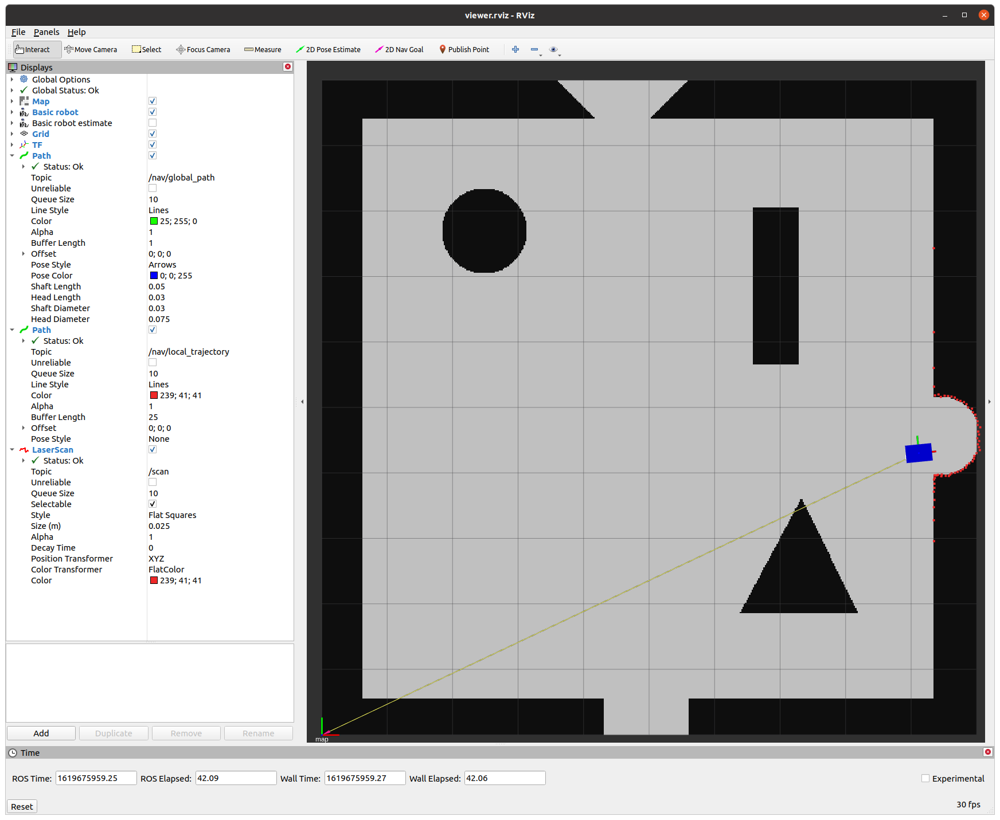
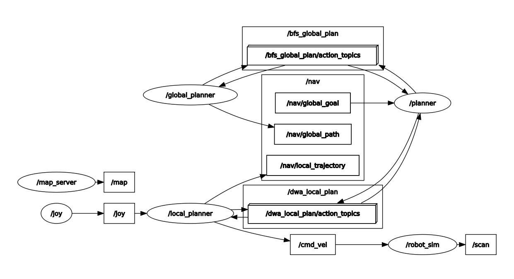

# beertender_robot 

[](https://github.com/venkisagunner93/beertender_robot/actions)

This repository is for building high-level software for beertender robot.

TO-DO:

- [x] Create-2 driver integration
- [x] Path planning
    - [x] Global planning
    - [x] Local planning
- [ ] Localization
    - [ ] Motion model
    - [ ] Sensor model
- [ ] CI/CD
    - [x] Build pipeline
    - [x] Self-hosted runner
    - [ ] Testing pipeline
        - [ ] gtest/gmock
        - [ ] rostest 
    - [ ] Code quality pipeline
        - [x] clang-format
        - [ ] catkin_lint
        - [ ] roscpp_lint
    - [x] Deployment pipeline
        - [x] Containerize deployment
        - [x] Robot as a docker registry 
    - [ ] Data collection pipeline
        - [ ] Logs
        - [ ] Bag files
        - [ ] Metrics

## How to run?

```sh
cd $HOME
git clone https://github.com/venkisagunner93/beertender_robot.git
cd beertender_robot
source tools/setup.sh
beertender --sdk
sdk
```

Output looks like the following:



## ROS Graph

