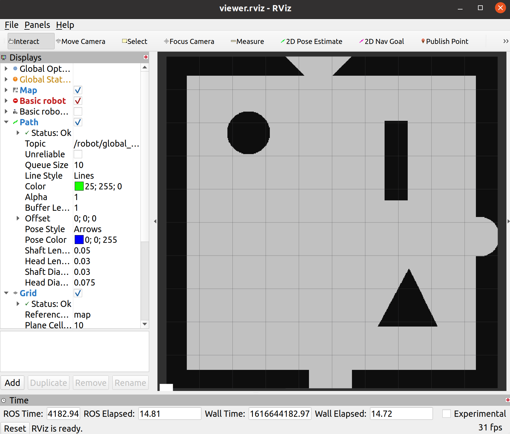

# beertender_robot

This repository is for building high-level software for beertender robot.

TO-DO:

- [ ] Create-2 driver integration
- [x] Path planning
    - [x] Global planning
    - [x] Local planning
- [ ] Localization
    - [ ] Motion model
    - [ ] Sensor model
- [ ] CI/CD
    - [x] Build pipeline
    - [ ] Testing pipeline
    - [ ] Code quality pipeline
    - [ ] Deployment pipeline 

## Package structure

Coming soon

## How to run?

```sh
cd $HOME
git clone https://github.com/venkisagunner93/beertender_robot.git
cd beertender_robot
catkin_make
source devel/setup.bash
roslaunch bringup robot_bringup.launch
```

Output looks like the following:


